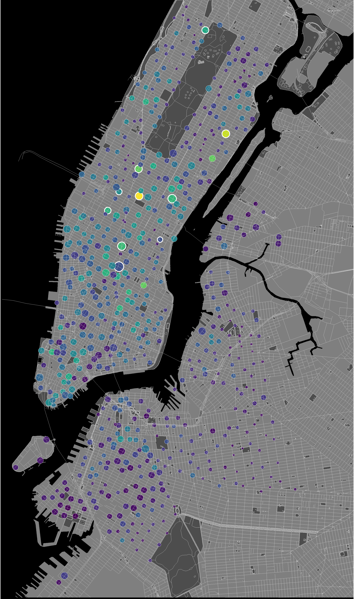

# Citi Bike Station Status

## Data archive

Historical data available in [data/monthly_csv](data/monthly_csv). Data were downloadced from the Citi Bike GBFS feed's [`station_status` endpoint](https://gbfs.citibikenyc.com/gbfs/en/station_status.json). The files also include data downloaded from a Google Drive archive created by Justin Tyndall, which is available [here](https://drive.google.com/drive/u/0/folders/1aLRu3GYHTVFG9BBxPUQM4N7xhbZNMxPV). I renamed some fields, and added some extra ones; data cleaning code is available in [code/station_status_database.R](code/station_status_database.R). The data is organized into monthly BZip archives, exported by [code/station_status_monthly.R](code/station_status_monthly.R).

Station information is available at the [`station_information` endpoint](https://gbfs.citibikenyc.com/gbfs/en/station_information.json).

### Data fields

|field                |example_value    |
|:--------------------|:----------------|
|last_reported        |1638334946       |
|num_docks_disabled   |0                |
|num_bikes_available  |17               |
|is_renting           |1                |
|station_status       |active           |
|station_id           |72               |
|is_returning         |1                |
|is_installed         |1                |
|num_bikes_disabled   |3                |
|num_ebikes_available |2                |
|num_docks_available  |35               |
|year                 |2021             |
|month                |12               |

This example data is also available at [data/example_data.csv](data/example_data.csv).

## Shiny map

Code and data for a [Shiny app](https://chrisgettings.shinyapps.io/Citibike_stations_map/), displaying a snapshot of 382 citi bike stations at 8:00 AM on 9/22/2017, on a [leaflet](https://rstudio.github.io/leaflet/) map.

## Static station map

**Highlighting the top-10 stations**

